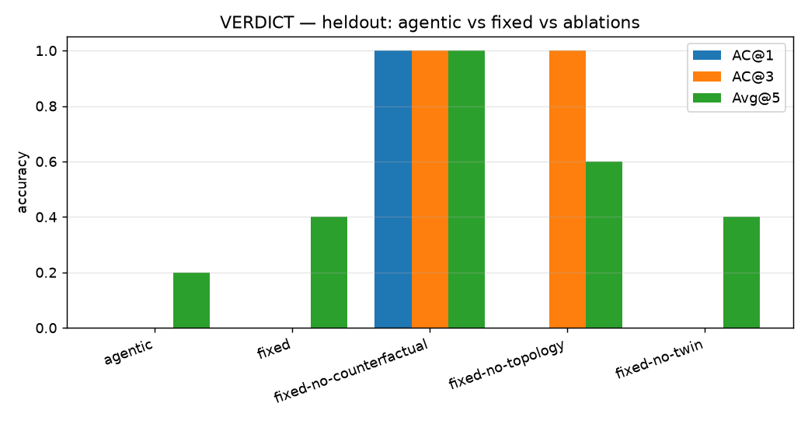

# VERDICT — benchmark results

## heldout

| mode | n | AC@1 | AC@3 | Avg@5 |
| --- | --- | --- | --- | --- |
| agentic | 1 | 0.000 | 0.000 | 0.200 |
| fixed | 1 | 0.000 | 0.000 | 0.400 |
| fixed-no-counterfactual | 1 | 1.000 | 1.000 | 1.000 |
| fixed-no-topology | 1 | 0.000 | 1.000 | 0.600 |
| fixed-no-twin | 1 | 0.000 | 0.000 | 0.400 |

## synthetic

| mode | n | precision@1 | precision@3 | red-herring false-blame | median time-to-RCA (s) |
| --- | --- | --- | --- | --- | --- |
| agentic | 23 | 0.391 | 0.696 | 0.000 | 40.161 |
| fixed | 23 | 0.522 | 0.739 | 0.000 | 2.838 |

## Agent efficiency — agentic vs fixed

The fixed pipeline spends the same budget on every case (5 counterfactuals + 1 twin) whether the case needs it or not. The agent chooses its targets. The claim is equal-or-better AC@k for fewer expensive ops — so this table, not AC@k alone, is the result.

| suite | mode | n | mean tool calls | mean cost points | mean expensive ops | mean wall-clock (s) |
| --- | --- | --- | --- | --- | --- | --- |
| heldout | agentic | 1 | 8.000 | 5.000 | 5.000 | 38.467 |
| heldout | fixed | 1 | 0.000 | 0.000 | 6.000 | 5.410 |
| heldout | fixed-no-counterfactual | 1 | 0.000 | 0.000 | 1.000 | 7.919 |
| heldout | fixed-no-topology | 1 | 0.000 | 0.000 | 6.000 | 2.879 |
| heldout | fixed-no-twin | 1 | 0.000 | 0.000 | 5.000 | 1.824 |
| synthetic | agentic | 25 | 8.800 | 5.680 | 3.480 | 39.409 |
| synthetic | fixed | 25 | 0.000 | 0.000 | 5.040 | 2.928 |

## LLM cost per case

- `OPENAI_API_KEY` present: **True**
- measured USD/case: **0.050**
- runs that degraded to the autopilot: **0**

> OPENAI_API_KEY present: $0.0500/case measured across 1 runs — investigator (gpt-4o), challenger/remediation (gpt-4o-mini) and narrator, metered per response in backend/agents/usage.py.

## External baselines (RCAEval)

> Skipped: nsigma: RCAEval not importable (No module named 'RCAEval'); baro: RCAEval not importable (No module named 'RCAEval')

---

Reproduce: `make bench` (see README §Reproduce the numbers).